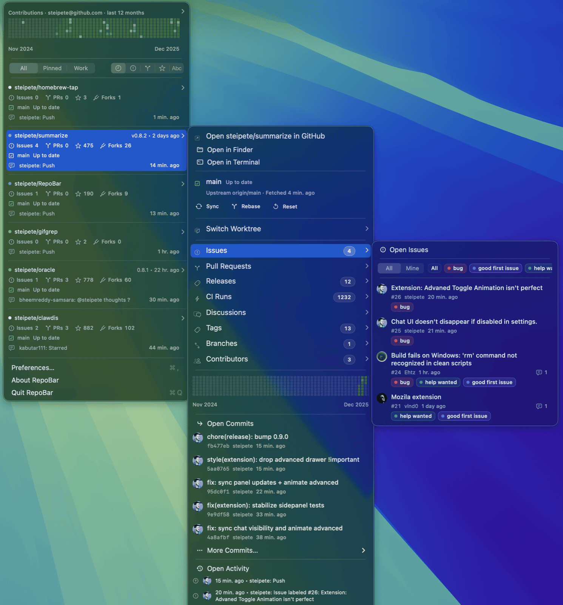

# RepoBar 🚦 — GitHub without the tab sprawl

[](https://github.com/steipete/RepoBar/actions/workflows/ci.yml)
[](https://github.com/steipete/RepoBar/releases/latest)
[](https://repobar.app/)
[](https://www.swift.org/)
[](LICENSE)

RepoBar is a native macOS menu bar app for maintainers who track many GitHub repositories. It keeps issue and pull request counts, CI, releases, activity, rate limits, and local checkout state in one menu.



## Install

Install the Homebrew cask:

```sh
brew install --cask repobar
```

RepoBar requires macOS 15 or newer. A signed app archive is also available from the [latest GitHub release](https://github.com/steipete/RepoBar/releases/latest).

## Quick start

1. Open RepoBar from Applications. Its traffic-light icon appears in the menu bar.
2. Select **Sign in to GitHub** and complete the browser login.
3. Open **Preferences → Repositories** to choose visible, pinned, and hidden repositories.
4. Select a repository in the menu to inspect its issues, pull requests, releases, CI runs, branches, tags, commits, and activity.

That is the complete setup for GitHub.com. Local checkout status and archive-backed offline data are optional.

## Repository dashboard

The main menu shows issue and pull request pressure, stars, forks, recent activity, CI state, releases, and contribution heatmaps. Filters narrow the list to pinned repositories, local checkouts, or repositories with active work.

Each repository opens a submenu with recent GitHub activity and, when a local checkout is configured, its branch, upstream, dirty files, ahead/behind state, and worktrees. RepoBar can open the checkout in Finder or a terminal and can fast-forward clean repositories without discarding local changes.

**Preferences → Repositories** searches the repositories available to the active account. Search covers names, descriptions, languages, and topics; visibility rules remain visible when an account temporarily loses access, which makes permission problems easier to diagnose.

## Authentication and private repositories

RepoBar supports GitHub.com and GitHub Enterprise. GitHub.com login uses a GitHub App user token, so access is limited by both the signed-in user and the repositories where the [RepoBar GitHub App](https://github.com/apps/repobar/installations/new) is installed.

Install the GitHub App on an organization to expose its private repositories. A Personal Access Token with repository and organization read access is available for SAML SSO or repositories outside that installation boundary. GitHub Enterprise uses its configured HTTPS host and OAuth settings.

Release builds store credentials in the macOS Keychain. Debug builds use file-backed storage to avoid Keychain prompts; [auth storage](docs/auth-storage.md) documents the exact behavior.

## Local projects

Choose a projects folder in **Preferences → Advanced → Local Projects** to match GitHub repositories with local checkouts. RepoBar reports branches, worktrees, dirty files, and upstream state; optional auto-sync runs only for clean, non-detached repositories that can fast-forward.

See [Local Projects](docs/reposync.md) for scanning, matching, sandbox access, caching, and sync rules.

## Caching and archives

RepoBar opens from its persistent SQLite cache first and refreshes GitHub data in the background. The GitHub API Status menu shows REST and GraphQL quotas, endpoint cooldowns, and the age of cached samples.

Git-backed GitHub archive snapshots can seed the cache when GitHub is rate-limited or unavailable. RepoBar owns the imported database and archive configuration; it does not modify the source archive. See the [cache and archive design](docs/cache.md).

The optional clipboard reference monitor recognizes GitHub URLs, issue and pull request references, commit hashes, and workflow-run URLs. It checks the cache first and performs a live lookup only when needed.

## Command-line interface

RepoBar bundles a `repobar` CLI for automation and diagnostics. Install it from **Preferences → Advanced → CLI**, then use `--plain` for terminal tables or `--json` for structured output:

```sh
repobar repos --sort prs --plain
repobar rate-limits --plain
repobar cache status --json
```

The [CLI reference](docs/cli.md) covers authentication, repositories, local Git actions, caches, archives, settings, and output formats.

## Documentation

- [Product and technical specification](docs/spec.md)
- [CLI reference](docs/cli.md)
- [Cache and archive design](docs/cache.md)
- [Authentication storage](docs/auth-storage.md)
- [Local project sync](docs/reposync.md)
- [Release process](docs/release.md)

## Development

Development requires macOS, Xcode 26 with Swift 6.2, Node.js 22.12 or newer, and pnpm 10.

```sh
pnpm install
pnpm build
pnpm check
```

The [repository guide](AGENTS.md) describes the project layout, local app workflow, and focused test commands.

## License

RepoBar is available under the [MIT License](LICENSE).
