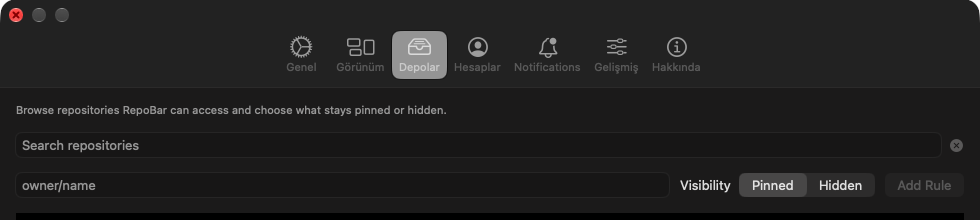

# Turkish localization runtime proof

Captured and verified against the current PR #114 head on 2026-09-01:

- Head: `62347e02a2f993368110b096acdb4191cd3c09d9`
- Commit: `docs: add Turkish localization runtime proof`
- The evidence below uses repo-relative paths only.
- No GitHub token, API key, account credential, or user data was used in the CLI proof.
- No merge was performed while collecting this evidence.

## CLI behavior

Command:

```sh
REPOBAR_LANGUAGE=tr swift run --disable-sandbox repobarcli --help
```

Exit code: `0`.

Observed terminal output excerpt:

```text
repobar - depoları etkinlik, sorunlar, PR'ler ve yıldızlara göre listele

Kullanım:
  repobar [repos] [--limit N] [--age DAYS] [--release] [--event] [--forks] [--archived] [--scope VAL] [--filter VAL]
          [--pinned-only] [--only-with VAL] [--owner LOGIN] [--mine] [--json] [--plain] [--sort KEY]

Seçenekler:
  --no-color   Renkli çıktıyı devre dışı bırak
  -h, --help   Yardımı göster
```

The command name, flags, placeholders, and technical identifiers remain unchanged while
human-readable headings and prose are Turkish.

## Dynamic CLI trace

This network-free command uses a synthetic reference so no real repository or account data is
needed:

```sh
REPOBAR_LANGUAGE=tr swift run --disable-sandbox repobarcli reference-translate 'example-org/demo-repo#42' --plain
```

Exit code: `0`. The dynamic input is retained literally:

```text
query: repositoryIssueNumber
display: example-org/demo-repo#42
repo: example-org/demo-repo
repo-name: demo-repo
number: 42
```

This is evidence for the `reference-translate` path only. It does not claim that configured
archive names are safe; the P1 limitation below remains open.

## Packaged app behavior

Commands:

```sh
pnpm build
find .build/debug/RepoBar.app/Contents/Resources -maxdepth 2 -type f -name Localizable.strings -print | sort
```

`pnpm build` completed successfully. The packaged resources were present:

```text
.build/debug/RepoBar.app/Contents/Resources/en.lproj/Localizable.strings
.build/debug/RepoBar.app/Contents/Resources/tr.lproj/Localizable.strings
```

Command:

```sh
swift -e 'import Foundation; let bundle = Bundle(path: ".build/debug/RepoBar.app"); let tr = bundle?.path(forResource: "tr", ofType: "lproj").flatMap(Bundle.init(path:)); print(tr?.localizedString(forKey: "Main Menu", value: nil, table: nil) ?? "MISSING")'
```

Observed output:

```text
Ana Menü
```

## Current-head macOS UI capture

The exact-head debug app was launched through the repository’s `pnpm start` flow with an
isolated proof bundle identifier. Peekaboo reported Screen Recording and Accessibility as
granted and captured the live RepoBar settings window. The full live window contained the
machine’s configured repository rows, so that original capture was discarded. The committed
artifact is a deterministic crop above those rows and contains only the real window chrome,
Turkish tab labels, and static controls.



The visible Turkish tab labels are `Genel`, `Görünüm`, `Depolar`, `Hesaplar`, `Bildirimler`,
`Gelişmiş`, and `Hakkında`. The delivered crop contains no repository name, account identifier,
token, cookie, email address, or local filesystem path. Its PNG metadata is `980x220`, RGBA;
29171 bytes, SHA-256 `4b65fdfa0257ce18f16f9468e3f6b09fa4b199a852b63a59f72a3a5139e34c32`.

Computer Use state capture was attempted but ScreenCaptureKit returned error `-3811` because
the session was fronted by `loginwindow`; no Computer Use failure is presented as successful
UI evidence. The successful live capture came from Peekaboo after the exact-head app window
was identified and captured.

## Verification

```sh
pnpm check
```

Result: exit code `0`; `680 tests in 110 suites passed`.

Additional focused checks:

```sh
swift test --disable-sandbox
swiftformat Sources/repobarcli --lint
swiftlint lint --strict --quiet
```

Results:

- Swift Testing: `680 tests in 110 suites passed`.
- SwiftFormat: `0/29 files require formatting` for `Sources/repobarcli`.
- SwiftLint: passed with no output.
- `git diff --check`: run after this proof update; must remain clean.

The repository `pnpm check` formatter mechanically renamed five unrelated test functions in
`Tests/repobarcliTests/CLIParsingTests.swift`; those out-of-scope changes were reverted and
are not part of this evidence package.

## Known blocker: P1 dynamic-value integrity

The current head still contains a prefix translator in
`Sources/repobarcli/Localization.swift:45` and applies it to completed lines at lines `73-74`.
`Sources/repobarcli/ArchiveCommands.swift:38` sends the configured archive name as the first
part of a line. Therefore an archive name beginning with `Invalid ` can be rewritten by Turkish
prefix translation. The dynamic trace above intentionally uses a different CLI path and does
not clear this P1 finding.

No source repair was made while preparing evidence. The PR is not merge-ready until the
dynamic archive-name case is repaired and re-tested, and the current-head app capture and CLI
proof are reviewed by ClawSweeper.

## Suggested PR body update

```md
Current-head verification for PR #114 (`62347e02a2f993368110b096acdb4191cd3c09d9`):

- `REPOBAR_LANGUAGE=tr swift run --disable-sandbox repobarcli --help` exits 0 and shows Turkish `Kullanım`, `Seçenekler`, and CLI help prose while preserving command tokens and flags.
- A network-free dynamic trace preserves the synthetic value `example-org/demo-repo#42` literally in `reference-translate` output.
- `pnpm build`, `pnpm check`, SwiftFormat, SwiftLint, and `swift test --disable-sandbox` pass; Swift Testing reports 680 tests in 110 suites.
- The packaged app contains both `en.lproj` and `tr.lproj`; a current-head macOS settings-window capture shows Turkish tabs including `Genel`, `Görünüm`, `Depolar`, `Hesaplar`, `Bildirimler`, `Gelişmiş`, and `Hakkında`.


The capture is redacted to exclude configured repository rows. The P1 dynamic archive-name prefix-translation issue remains open and is not claimed as fixed by this proof; it must be repaired and re-tested before merge.
```
