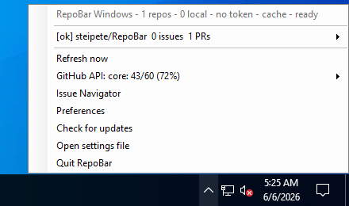

# RepoBar for Windows

RepoBar's Windows support is a native taskbar notification-area companion. It is intentionally separate from the macOS SwiftUI/AppKit app because that stack is macOS-only.

The Windows app currently provides:

- a single-instance tray process
- left-click or right-click taskbar menu access
- configured repository status rows with issue/PR counts, CI, release, stars/forks, local sync, traffic, activity, and heatmap signals
- optional local project discovery
- local branch, upstream, ahead/behind, dirty-file, and worktree state
- local fetch, fast-forward sync, branch switching, worktree creation, and worktree navigation actions
- issue and pull request counts
- latest default-branch Actions run status
- latest release link
- optional traffic views/clones, commit activity summary, and changelog headline
- recent issue, pull request, release, CI run, branch, tag, commit, contributor, activity, and discussion submenus
- direct links to GitHub repository, Issues, Pull Requests, and Actions
- native Preferences window for named account profiles, GitHub host, GitHub App browser sign-in, Credential Manager token storage, token environment variable, local project scanning, local worktree folder, refresh cadence, repository discovery filtering, and repository visibility
- filtered repository discovery from GitHub's accessible repository list
- repository checkout from the tray into the configured local projects folder
- ETag-backed response cache with stale reads when GitHub is temporarily unavailable
- optional RepoBar archive SQLite fallback for recent issue and pull request submenus
- optional signed-in account contribution totals and compact heatmap summary from GitHub GraphQL
- optional GitHub API rate-limit row with REST/GraphQL bucket quota, reset, blocker, and shared-budget details
- optional Actions summary with latest workflow state, active queue counts, billing usage, cache usage, and self-hosted runner state per configured repository
- optional pull request notifications through Windows tray balloons with click-through and persistent duplicate suppression
- Issue Navigator window for pasted GitHub URLs and issue/PR references with an embedded browser preview
- tray-level log out for clearing the active account's stored OAuth and PAT credentials
- optional launch-at-login registration for the current Windows user
- manual update check against the latest GitHub release with Windows installer asset detection

## Build

Requirements:

- Windows 10 2004 or newer
- .NET 8 SDK

```powershell
.\Scripts\build_windows.ps1 build -Runtime win-x64
.\Scripts\build_windows.ps1 test
.\Scripts\build_windows.ps1 publish -Runtime win-x64
.\Scripts\package_windows.ps1 -Runtime win-x64
```

Use `win-arm64` on Windows on Arm.

## Package

`Scripts\package_windows.ps1` publishes a self-contained Windows build into `dist\windows\publish\<runtime>` and, when Inno Setup 6 is installed, builds an installer from `Windows\installer.iss`.

Use `-SkipInstaller` to validate the publish layout without requiring the Inno compiler:

```powershell
.\Scripts\package_windows.ps1 -Runtime win-x64 -SkipInstaller
```

The installer can optionally create a desktop shortcut and a current-user startup entry.

Use **Launch at login** in Preferences to add or remove the current executable from the current user's Windows `Run` registry key. Use **Check for updates** from the tray menu to compare the running app version with the latest RepoBar GitHub release and open the Windows installer asset when one is attached.

## Run

```powershell
.\Scripts\build_windows.ps1 run
```

The first run creates:

```text
%APPDATA%\RepoBar\windows-settings.json
```

Use **Preferences** from the tray menu to choose repositories and local project settings. The same values are stored in JSON for scriptable setup:

```json
{
  "githubHost": "github.com",
  "tokenEnvironmentVariable": "REPOBAR_GITHUB_TOKEN",
  "gitHubOAuthClientId": "Iv23liGm2arUyotWSjwJ",
  "gitHubOAuthClientSecretEnvironmentVariable": "REPOBAR_GITHUB_CLIENT_SECRET",
  "activeAccountId": "default",
  "accounts": [
    {
      "id": "default",
      "label": "Default",
      "githubHost": "github.com",
      "tokenEnvironmentVariable": "REPOBAR_GITHUB_TOKEN",
      "gitHubOAuthClientId": "Iv23liGm2arUyotWSjwJ",
      "gitHubOAuthClientSecretEnvironmentVariable": "REPOBAR_GITHUB_CLIENT_SECRET"
    }
  ],
  "refreshIntervalMinutes": 5,
  "openMenuOnLeftClick": true,
  "launchAtLogin": false,
  "discoverLocalProjects": true,
  "localProjectsRoot": "%USERPROFILE%\\Projects",
  "localProjectsMaxDepth": 3,
  "localWorktreeFolderName": ".work",
  "fetchLocalProjectsBeforeStatus": true,
  "autoSyncLocalProjects": false,
  "enableResponseCache": true,
  "gitHubArchiveDatabasePath": "%APPDATA%\\RepoBar\\Archives\\example.sqlite",
  "showRateLimits": true,
  "showContributionSummary": true,
  "enablePullRequestNotifications": false,
  "showActionsUsage": false,
  "repositories": [
    { "owner": "steipete", "name": "RepoBar", "visibility": "pinned" }
  ]
}
```

## Validation

Run the local Windows build and unit-test gates:

```powershell
.\Scripts\build_windows.ps1 build -Runtime win-x64
.\Scripts\build_windows.ps1 test
```

The test command writes a TRX result file under `dist\windows\test-results\`, including the combined GitHub/local repository status coverage.

Run the launch smoke on Windows:

```powershell
.\Scripts\smoke_windows.ps1 -Runtime win-x64
```

The smoke publishes the app, launches `RepoBar.Windows.exe`, verifies the generated settings file, and writes a PNG screenshot plus JSON summary under `dist\windows\smoke\` when a desktop surface is available.



The checked-in screenshot above was captured from a Crabbox AWS Windows desktop lease with `crabbox desktop launch` and `crabbox screenshot`, then cropped to exclude instance metadata.

Run the hosted Windows Crabbox validation from a machine with Crabbox access:

```bash
CRABBOX_PROVIDER=aws CRABBOX_TARGET=windows pnpm windows:crabbox
```

## Authentication

Use **Preferences** to add named account profiles and choose the active account. Each account stores its GitHub host, token environment variable, OAuth client ID, and OAuth secret environment variable. The active account drives repository discovery, refreshes, Actions insight, contribution summaries, and Credential Manager target names. Use **Log out** from the tray menu to clear the active account's stored OAuth and PAT credentials.

Use **Sign in with GitHub** to authenticate the active account through the RepoBar GitHub App browser flow. RepoBar listens on the same loopback callback as the macOS app, exchanges the PKCE code for GitHub user tokens, stores the OAuth token bundle in Windows Credential Manager, and refreshes it before GitHub requests when needed. The built-in RepoBar client ID is used by default; set `REPOBAR_GITHUB_CLIENT_SECRET` or the configured OAuth secret environment variable before signing in.

OAuth tokens are stored under a per-host target such as:

```text
RepoBar.Windows.OAuth:github.com
RepoBar.Windows.OAuth:github.com:work-account
```

You can also save a personal access token in Windows Credential Manager. RepoBar stores PATs separately under a per-host target such as:

```text
RepoBar.Windows:github.com
RepoBar.Windows:github.com:work-account
```

Environment variables still work as bootstrap/fallback:

```powershell
$env:REPOBAR_GITHUB_TOKEN = "<token>"
```

The app also checks `GITHUB_TOKEN` and `GH_TOKEN`. Tokens are not written to the settings file. Private repositories require the RepoBar GitHub App to be installed for OAuth access, or a token with repository read access.

## Cache and Archives

When `enableResponseCache` is true, RepoBar stores ETag-backed REST responses and can reuse stale responses after temporary GitHub failures.

Set `gitHubArchiveDatabasePath` to a RepoBar-owned archive SQLite database produced from the same portable snapshot format as the macOS app. When the live recent issue or pull request endpoint is rate-limited, forbidden, offline, or returns malformed JSON, the Windows tray reads open `threads` rows from the archive so the issue and pull request submenus do not go blank. RepoBar only reads this database; it does not edit gitcrawl config or write into crawler-owned stores.

## Local Projects

When `discoverLocalProjects` is enabled, RepoBar scans `localProjectsRoot` for Git checkouts. It matches each checkout's `origin` remote to configured repositories and adds branch, upstream, ahead/behind, dirty-file, local branch switching, worktree creation/navigation, fetch, sync, and folder/terminal actions to the tray menu. Repositories without a local match can be checked out into `localProjectsRoot` from the tray.

Sync is intentionally conservative: manual and automatic sync use `git pull --ff-only`, and auto-sync only runs for clean repositories that are behind their upstream.

Local-only repositories are shown in their own tray section so Windows can still be useful without GitHub authentication.

Repository entries support `visible`, `pinned`, and `hidden` visibility. The tray menu can pin, hide, or restore configured repositories, and writes the updated settings file immediately.

## Design Notes

The Windows target follows the same tray-first shape used by robust Windows companions:

- initialize the tray icon before any optional UI
- keep the tray alive even when a repository refresh fails
- capture repository state, then render the menu from that snapshot
- use native shell opening for GitHub links and settings files

The next natural step is a WinUI 3 flyout for richer cards once the basic Windows packaging path is proven.

See [windows-parity.md](windows-parity.md) for the full parity checklist.
